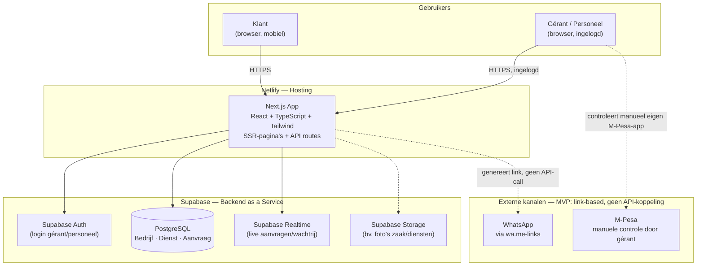
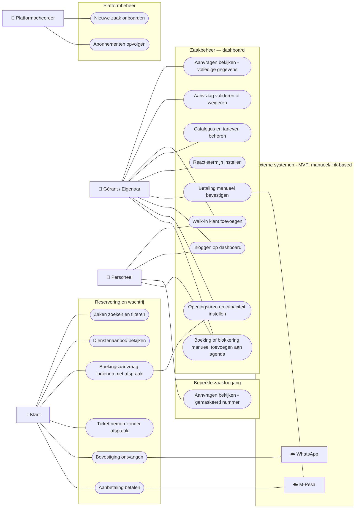
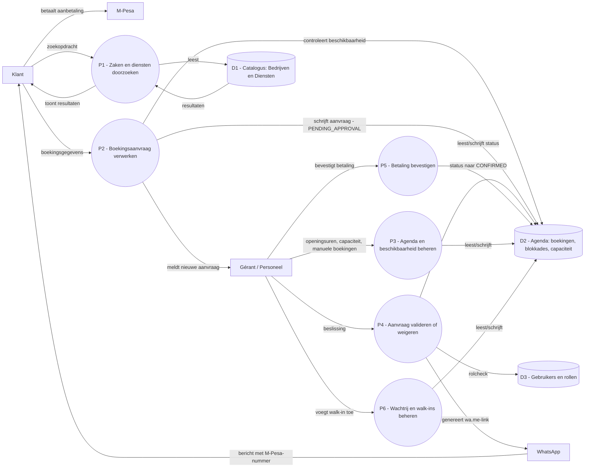

# Functioneel Ontwerp & Vereistendocument – KinoBooking

## Documentinformatie

| Veld | Waarde |
|---|---|
| Projectnaam | KinoBooking |
| Documenttype | Functioneel ontwerp / Cahier des charges (Business Analyst document) |
| Versie | 1.6 |
| Datum | 2026-09-07 |
| Methode | Secties 1–10 en 14: reverse-engineering van de bestaande prototype-code (`index.html`). Secties 11–13: vooruitblikkend ontwerp (user stories, MVP-scope, architectuur — inclusief het use case- en dataflow-diagram) op basis van team-beslissingen. Enkele onderdelen van secties 4, 5, 6 en 7 zijn eveneens vooruitblikkend (de centrale agenda) en zijn inline gemarkeerd als "vooruitblikkend". |
| Status | Beschrijft zowel de huidige werking van het **statische front-end prototype** als de **afgesproken doelarchitectuur** voor de MVP |

> **Belangrijke opmerking vooraf.** Secties 1 t.e.m. 10 en 14 van dit document zijn hoofdzakelijk opgesteld door de broncode van het prototype te analyseren (HTML-structuur, Tailwind-klassen en de JavaScript-logica in `index.html`) en beschrijven dus wat de applicatie **vandaag daadwerkelijk doet**, inclusief de plekken waar functionaliteit gesimuleerd is (bijv. met een `alert()`) in plaats van echt geïmplementeerd — sectie 9 vat deze beperkingen expliciet samen. Een aantal onderdelen daarin (met name de centrale agenda, zie 4.9, 6.4–6.5, 7.5, BR-10/BR-11) zijn expliciet gemarkeerd als **"vooruitblikkend"**: ze bestaan niet in het prototype maar zijn toegevoegd na een teambeslissing. Secties 11 (user stories), 12 (MVP-scope) en 13 (architectuur, met use case-diagram in 13.3 en dataflow diagram in 13.4) zijn volledig **vooruitblikkend**: ze beschrijven wat gebouwd moet worden en met welke technologie, niet wat er vandaag al bestaat.

---

## 1. Inleiding

### 1.1 Doel van dit document

Dit document beschrijft de functionele en niet-functionele werking van **KinoBooking**, een platform voor het reserveren van diensten en het beheren van wachtrijen bij schoonheidssalons, kapsalons/spa's en horecazaken (restaurants, lounges) in Kinshasa en Lubumbashi (DR Congo). Het dient als basis voor:

- een gedeeld begrip tussen opdrachtgever en ontwikkelteam over de bestaande functionaliteit;
- de overgang van een klikbaar HTML/JS-prototype naar een volwaardige, productieklare applicatie (backend, database, betalingen, authenticatie);
- toekomstige scope- en prioriteitsbeslissingen.

### 1.2 Achtergrond en context

KinoBooking richt zich op twee marktsegmenten in Kinshasa (en later Lubumbashi):

1. **Beauté, Coiffure & Spa** – kapsalons, pruiken/tissage-specialisten, vlechtsalons (braids), spa's.
2. **Horeca** – restaurants en lounges, met een aparte flow voor tafel- en VIP-zaalreserveringen.

Beide segmenten kampen in de praktijk met vergelijkbare problemen die het platform probeert op te lossen:

- klanten moeten fysiek aanschuiven zonder zekerheid over wachttijd (walk-ins);
- eigenaars hebben geen centraal overzicht van aanvragen, afspraken en aanbetalingen;
- personeelsleden hebben soms toegang tot klantgegevens (telefoonnummers) en kunnen die gebruiken om klanten buiten de zaak om te bedienen ("klantendiefstal");
- er is geen gestructureerde manier om klanten na verloop van tijd opnieuw te benaderen (retentiemarketing).

### 1.3 Scope en methode

De scope van dit document is beperkt tot wat aantoonbaar aanwezig is in het huidige prototype (`index.html`, één statisch bestand met Tailwind CSS, Font Awesome-iconen en vanilla JavaScript, zonder build-proces, backend of database). Aannames of uitbreidingen die niet in de code zitten, worden apart vermeld onder "Aanbevelingen voor doorontwikkeling" (sectie 11) en niet vermengd met de functionele beschrijving van het prototype zelf.

---

## 2. Doelgroepen en gebruikersrollen

Het prototype onderscheidt vier rollen, zichtbaar via de tabbladen "Vue Client", "Espace Salon / Horeca" en "Admin SaaS", plus een rolselector binnen het dashboard:

| Rol | Omschrijving | Toegang in het prototype |
|---|---|---|
| **Eindklant** | Consument die een dienst, tafel of zitplaats zoekt en reserveert | "Vue Client" – zoeken, filteren, reserveren met afspraak of ticket zonder afspraak |
| **Gérant / Eigenaar** | Eigenaar of manager van een salon of horecazaak | "Espace Salon / Horeca" met volledige rechten (CRM, volledige telefoonnummers) |
| **Personeel (bv. kapster)** | Medewerker van de zaak | "Espace Salon / Horeca" met beperkte rechten (gemaskeerde telefoonnummers, geen CRM-toegang) |
| **KinoBooking Platformbeheerder** | Beheerder van het SaaS-platform zelf | "Admin SaaS" – overzicht van abonnementen, opties en platforminkomsten |

> In het huidige prototype is er **geen echte authenticatie**: de rol wordt gekozen via een `<select>`-dropdown in het dashboard ("Profil de Connexion") en de tabbladen zijn voor iedereen zonder login zichtbaar. Dit is uitdrukkelijk een simulatie van rolgedrag, geen beveiligingsmaatregel (zie sectie 10).

---

## 3. Globale werking van het prototype

De applicatie is een "single-page"-achtige HTML-pagina met drie hoofdweergaven die via JavaScript worden getoond/verborgen (geen echte routing/URL's):

1. **Vue Client** (`#view-client`) – standaard zichtbaar bij het laden van de pagina.
2. **Espace Salon / Horeca** (`#view-dashboard`) – ondernemersdashboard.
3. **Admin SaaS** (`#view-admin`) – platformbeheer en monetisatie-overzicht.

Bovenaan de pagina toont de header permanent:
- het KinoBooking-logo en de steden "Kinshasa • Lubumbashi";
- de actuele wisselkoers USD → CDF (Congolese Frank), in het prototype vast ingesteld op **1 USD = 2.850 CDF**;
- de tab-schakelaar tussen de drie bovenstaande weergaven.

Alle gegevens (bedrijven, diensten, aanvragen) worden in JavaScript-arrays in het geheugen bijgehouden (`businesses`, `requests`). Er is **geen backend en geen database**: bij het herladen van de pagina gaan alle wijzigingen (nieuwe aanvragen, toegevoegde diensten, statuswijzigingen) verloren en verschijnen opnieuw de oorspronkelijke mockgegevens.

---

## 4. Functionele vereisten

Elke functionele eis krijgt een ID (FR = Functional Requirement) voor latere traceerbaarheid.

### 4.1 Module: Klantenportaal (Vue Client)

| ID | Beschrijving |
|---|---|
| FR-1.1 | Het systeem toont een zoekbalk waarmee de klant vrij kan zoeken op bedrijfsnaam, subcategorie of dienstnaam (bijv. "perruque", "braids", "restaurant", "VIP"). |
| FR-1.2 | Het systeem laat de klant filteren op gemeente/wijk via een dropdown ("Toutes les communes", "Kinshasa – Gombe", "Kinshasa – Ngaliema", "Lubumbashi – Golf"). |
| FR-1.3 | Het systeem toont twee hoofdcategorieën als schakelknoppen: **Beauté, Coiffure & Spa** en **Horeca (Restaurants & Lounges)**. De klant kan slechts één categorie tegelijk actief hebben; de bedrijvenlijst wordt hierop gefilterd. |
| FR-1.4 | Voor elk gefilterd bedrijf toont het systeem een kaart met: foto, subcategorie-badge, badge met maximale reactietijd ("Réponse < Xh"), naam, adres + gemeente, de twee populairste diensten met prijs, de laagste aanbetaling (omgerekend naar CDF), en twee actieknoppen: "Avec RDV" (met afspraak) en "Sans RDV" (zonder afspraak/wachtrij). |
| FR-1.5 | Wanneer geen enkel bedrijf aan de zoek-/filtercriteria voldoet, toont het systeem een lege-resultaten-melding. |
| FR-1.6 | Klikken op het logo brengt de gebruiker terug naar de klantweergave, ongeacht het actieve tabblad. |

### 4.2 Module: Reservering met afspraak ("Avec Rendez-vous")

| ID | Beschrijving |
|---|---|
| FR-2.1 | De klant selecteert een dienst (bij Beauté) of een tafel/ruimte (bij Horeca) uit een dropdown die specifiek is voor het gekozen bedrijf. Het label past zich aan afhankelijk van de hoofdcategorie ("Sélectionnez la Prestation" vs. "Sélectionnez la Table ou l'Espace"). |
| FR-2.2 | Bij het selecteren van een dienst toont het systeem een beschrijving met naam, prijs, duur (in minuten) en volledige toelichting. |
| FR-2.3 | Voor Beauté-bedrijven kan de klant optioneel een voorkeursmedewerker(-ster) kiezen (bijv. "Sarah – Spécialiste Tissage", "Grace – Spécialiste Closure & Braids") of "geen voorkeur". Dit veld wordt verborgen voor Horeca-bedrijven. |
| FR-2.4 | De klant kan een schakelaar "Réservation Discrète / VIP" activeren. Dit voegt **+ $10** toe aan de vereiste aanbetaling en past de dienstbeschrijving aan om te vermelden dat een privéruimte/gereserveerde stoel wordt voorzien. |
| FR-2.5 | De klant kiest een gewenste datum (standaard vandaag) en een tijdstip uit een vaste lijst van beschikbare tijdsloten (10:00, 12:00, 14:30, 17:00). |
| FR-2.6 | De klant vult voornaam en WhatsApp-nummer in. |
| FR-2.7 | Het systeem berekent en toont in real time het vereiste aanbetalingsbedrag in CDF én in USD, inclusief eventuele VIP-toeslag. |
| FR-2.8 | Bij het versturen van de aanvraag maakt het systeem een nieuwe aanvraag aan met een uniek referentienummer ("KINO-XXX"), status **PENDING_APPROVAL** (in afwachting van validatie), en voegt deze bovenaan de aanvragenlijst van het dashboard toe. De klant betaalt op dit moment **niets**; de aanvraag is gratis en vrijblijvend totdat de zaak de beschikbaarheid bevestigt. |
| FR-2.9 | Na het versturen krijgt de klant een bevestigingsmelding dat de aanvraag is verzonden en dat de zaak de beschikbaarheid nog moet valideren. |

### 4.3 Module: Reservering zonder afspraak / virtuele wachtrij ("Sans RDV")

| ID | Beschrijving |
|---|---|
| FR-3.1 | De klant kan binnen hetzelfde reserveringsvenster wisselen naar de modus "File Sans RDV (Direct)". |
| FR-3.2 | In deze modus vult de klant enkel voornaam, WhatsApp-nummer en gewenste dienst in — geen datum, tijd, medewerker of VIP-optie. |
| FR-3.3 | Bij bevestiging kent het systeem onmiddellijk een volgnummer in de wachtrij toe (in het prototype een willekeurig getal tussen 1 en 8) en maakt een aanvraag aan met status **CONFIRMED** en een referentie "TICKET-N{nummer}", zonder aanbetaling. |
| FR-3.4 | De klant ontvangt een bevestigingsmelding met zijn/haar volgnummer en de mededeling dat een WhatsApp-melding volgt zodra de beurt nadert. |

### 4.4 Module: Ondernemersdashboard – Aanvragen & Agenda

| ID | Beschrijving |
|---|---|
| FR-4.1 | Het dashboard toont in de header: bedrijfsnaam, actief abonnement ("Business Plan $49/m"), actieve opties (bijv. "+ Option Queue QR $15/m"), adres en het directe M-Pesa-nummer van de zaak. |
| FR-4.2 | Een rolselector ("Gérant/Propriétaire" vs. "Personnel/Coiffeuse") bepaalt of volledige klantgegevens zichtbaar zijn. In de personeelsrol worden telefoonnummers gemaskeerd (enkel de eerste 3 en laatste 2 cijfers zichtbaar) als bescherming tegen het "stelen" van klantcontacten door personeel. |
| FR-4.3 | Drie KPI-kaarten tonen: (a) de maximale reactietermijn die de zaak hanteert, (b) het aantal aanvragen dat nog op validatie wacht, (c) het totaalbedrag aan aanbetalingen dat rechtstreeks via M-Pesa is ontvangen. |
| FR-4.4 | Een tabel toont alle aanvragen met klant (+ VIP-badge indien van toepassing), dienst/medewerker, datum & tijd, aanbetalingsbedrag, status, en beschikbare acties. |
| FR-4.5 | Voor aanvragen met status **PENDING_APPROVAL** kan de zaak de aanvraag **valideren** (→ status wordt APPROVED_WAITING_PAYMENT, met de mededeling dat de klant een WhatsApp-bericht krijgt en 30 minuten heeft om de aanbetaling over te maken) of **weigeren** (de aanvraag wordt volledig verwijderd uit de lijst). |
| FR-4.6 | Aanvragen met status **APPROVED_WAITING_PAYMENT** tonen een badge "Timer Paiement: 30m" zonder verdere actieknop; het systeem wacht passief op de betaling van de klant. |
| FR-4.7 | Aanvragen met status **CONFIRMED** tonen enkel de referentie (bijv. "SUR-PLACE" of "TICKET-N3"). |
| FR-4.8 | Via het tandwiel-icoon kan de zaak de maximale reactietermijn instellen (in uren). Het systeem staat geen waarde toe boven de **6 uur**, conform het (in het prototype gesimuleerde) KinoBooking-reglement. |
| FR-4.9 | Via de knop "+ Client Sans RDV" kan personeel ter plaatse snel een walk-in-klant toevoegen (naam optioneel, dienst verplicht), wat direct een bevestigde aanvraag met referentie "SUR-PLACE" aanmaakt zonder aanbetaling. |

### 4.5 Module: Catalogus- en tariefbeheer

| ID | Beschrijving |
|---|---|
| FR-5.1 | De zaak kan haar volledige dienstenaanbod raadplegen als kaarten met categorie, duur, naam, beschrijving, totaalprijs en vereiste aanbetaling. |
| FR-5.2 | Via "Ajouter un Service" kan een nieuwe dienst worden toegevoegd met: naam, categorie, gedetailleerde klantgerichte beschrijving, duur (minuten), totaalprijs (USD) en aanbetaling (USD). |
| FR-5.3 | Een nieuw toegevoegde dienst verschijnt onmiddellijk bovenaan zowel de cataloguslijst van de zaak als de dienstenlijst die klanten te zien krijgen. |

### 4.6 Module: Automatische WhatsApp-marketing (add-on)

| ID | Beschrijving |
|---|---|
| FR-6.1 | Als betaalde optie ($20/maand) toont het systeem een uitleg dat het platform automatisch een gepersonaliseerd WhatsApp-bericht verstuurt naar klanten die 30 dagen niet zijn teruggekomen, om hen opnieuw uit te nodigen. |
| FR-6.2 | Het systeem benadrukt dat personeel **geen toegang** heeft tot de onderliggende telefoonnummers bij deze automatische heractivatie (privacybescherming). |
| FR-6.3 | Het dashboard toont een indicatieve omzet die deze module deze maand zou hebben gegenereerd (bijv. "$540.00" uit 12 automatische heractiveringen). |

### 4.7 Module: QR-wachtrij voor walk-ins (add-on)

| ID | Beschrijving |
|---|---|
| FR-7.1 | Als betaalde optie ($15/maand) kan de zaak een "Poster QR" openen die een visuele QR-code toont, bedoeld om aan de ingang van de zaak op te hangen. |
| FR-7.2 | De poster legt uit dat de klant de code scant, zijn naam invoert en vervolgens live op zijn telefoon zijn volgnummer in de wachtrij ziet. |
| FR-7.3 | Een knop laat toe een afdrukbare A4-versie (PDF) te "downloaden". |

### 4.8 Module: Platformbeheer (Admin SaaS)

| ID | Beschrijving |
|---|---|
| FR-8.1 | Het adminoverzicht toont vier omzetcategorieën: (a) basis-SaaS-abonnementen, (b) inkomsten uit de QR-wachtrij-optie, (c) inkomsten uit de WhatsApp-marketingoptie, (d) directe servicekosten op VIP-reserveringen. |
| FR-8.2 | Voor elke categorie toont het systeem het huidige maandbedrag en een korte toelichting (bijv. aantal zaken dat de optie afneemt). |
| FR-8.3 | Een tariefoverzicht toont de drie beschikbare opties/tiers met prijs en beschrijving: QR-wachtrijmodule (+$15/m), WhatsApp-marketing (+$20/m), en de VIP-reserveringsoptie (inbegrepen in Business/Pro-abonnementen, met een platform-servicekost van $3 tot $5 per VIP-boeking die de eindklant betaalt). |

### 4.9 Module: Centrale agenda- en beschikbaarheidsbeheer (vooruitblikkend — niet in het prototype)

> Deze module bestaat niet in het huidige prototype (dat werkt met vier vaste tijdsloten, zie beperking 4 in sectie 9). Ze is toegevoegd na een teambeslissing: de agenda moet het **enige punt van waarheid** worden voor de gérant, zodat die geen apart of dubbel systeem (papier, Google Calendar, …) moet bijhouden naast KinoBooking. De uitrol gebeurt in twee fases (zie BR-10 en BR-11).

| ID | Beschrijving |
|---|---|
| FR-9.1 | Het systeem biedt per zaak één centrale agenda waarin elke boeking terechtkomt, ongeacht de bron: een online aanvraag via het klantenportaal, een telefonisch genoteerde afspraak, of een klant die ter plaatse komt (walk-in). |
| FR-9.2 | De gérant kan per zaak de openingsdagen en -uren instellen, en per tijdsblok (bv. per uur of half uur) de beschikbare capaciteit configureren (aantal parallelle plaatsen/stoelen/tafels). |
| FR-9.3 | De gérant of het personeel kan rechtstreeks in de agenda een boeking of een blokkering (bv. verlofdag, persoonlijke afspraak) toevoegen, wijzigen of verwijderen. |
| FR-9.4 | Het klantenportaal toont uitsluitend tijdstippen waarvoor nog capaciteit beschikbaar is in de agenda; de vaste tijdsloten uit het prototype (10:00, 12:00, 14:30, 17:00) worden vervangen door dynamisch berekende beschikbaarheid. |
| FR-9.5 | **Fase 1.** Ook wanneer de agenda voldoende capaciteit toont, blijft de manuele validatie door de gérant behouden (status blijft `PENDING_APPROVAL` tot bevestiging) — dit blijft zo tot de betrouwbaarheid van de agenda in de praktijk (bij de pilootzaak) bevestigd is. |
| FR-9.6 | **Fase 2** (na de validatieperiode van fase 1). Zodra een tijdstip in de agenda beschikbaar is, wordt de aanvraag automatisch bevestigd zonder tussenkomst van de gérant, en krijgt de klant onmiddellijk het M-Pesa-nummer en het te betalen bedrag te zien. |
| FR-9.7 | Elke online aanvraag, elke walk-in en elke manuele invoer verbruikt dezelfde onderliggende capaciteit in de agenda, zodat er geen dubbele boeking kan ontstaan tussen de verschillende invoerkanalen. |

---

## 5. Bedrijfsregels (Business Rules)

| ID | Regel |
|---|---|
| BR-1 | Prijzen worden intern beheerd in **USD** en weergegeven in **CDF** via een vaste omrekeningskoers (in het prototype: 1 USD = 2.850 CDF). |
| BR-2 | Een reservering **met afspraak** is voor de klant volledig **gratis en vrijblijvend** totdat de zaak deze valideert; pas na validatie wordt een aanbetaling gevraagd. |
| BR-3 | De aanbetaling wordt **rechtstreeks door de klant aan de zaak** overgemaakt via mobiel geld (M-Pesa), niet via het platform zelf. |
| BR-4 | De VIP/discrete-optie voegt een vaste **+$10** toe aan de aanbetaling die de klant betaalt aan de zaak, en genereert daarnaast een aparte **servicekost van $3 tot $5 voor het platform** zelf, betaald door de eindklant. |
| BR-5 | Elke zaak stelt een **maximale reactietermijn** in voor het beantwoorden van aanvragen; deze termijn mag nooit hoger zijn dan **6 uur**, ongeacht wat de zaak zelf zou willen instellen. |
| BR-6 | Na validatie door de zaak krijgt de klant een venster van **30 minuten** om de aanbetaling te betalen (in het prototype is dit een informatief label; er is geen automatische aftelling of automatische annulering geïmplementeerd). |
| BR-7 | Reserveringen **zonder afspraak** (walk-in/wachtrij) vereisen **geen aanbetaling** en worden **onmiddellijk bevestigd** met een volgnummer, zonder validatiestap door de zaak. |
| BR-8 | Personeelsleden (rol "Personnel") mogen **nooit** het volledige telefoonnummer van een klant zien; enkel de eerste 3 en laatste 2 cijfers zijn zichtbaar. Enkel de rol "Gérant/Propriétaire" heeft volledige toegang. |
| BR-9 | Elk bedrijf behoort tot precies **één hoofdcategorie**: Beauté óf Horeca. Deze keuze bepaalt welke velden in het reserveringsformulier zichtbaar zijn (bijv. medewerkerkeuze enkel bij Beauté). |
| BR-10 | *(Vooruitblikkend, zie 4.9)* De centrale agenda is de enige bron van waarheid voor beschikbaarheid: elke boeking — online, telefonisch of ter plaatse — wordt erin geregistreerd, zodat de gérant nooit een apart of dubbel systeem moet bijhouden. |
| BR-11 | *(Vooruitblikkend, zie 4.9)* De overgang van fase 1 (manuele validatie, ondanks een beschikbare agenda) naar fase 2 (automatische bevestiging zodra er plaats is) gebeurt pas nadat de betrouwbaarheid van de agenda in de praktijk bij de pilootzaak bevestigd is. Dit is een bewuste, gefaseerde uitrol — geen technische beperking. |
| BR-12 | *(Vooruitblikkend, zie 14.2)* De introductieprijs ($9/maand basis, +$5/maand voor de QR-wachtrijoptie) geldt uitsluitend voor de **eerste 100 zaken** die zich aansluiten. Vanaf de 101e zaak geldt de standaardprijs ($49/maand, +$15/maand). Zaken die zich tijdens de introductieperiode aansloten, behouden hun introductieprijs ("founder pricing", locked-in). |

---

## 6. Gegevensmodel (zoals gebruikt in het prototype)

### 6.1 Entiteit: Bedrijf (`Business`)

| Veld | Type | Omschrijving |
|---|---|---|
| id | tekst | Unieke identificatie |
| name | tekst | Naam van de zaak |
| mainCat | enum | `Beauty` of `Horeca` |
| subCat | tekst | Subcategorie, getoond als badge (bv. "Coiffure & Perruques") |
| city | tekst | Gemeente + stad (bv. "Gombe, Kinshasa") |
| address | tekst | Straatadres |
| depositUsd | getal | Laagste aanbetaling, gebruikt in de overzichtskaart |
| image | URL | Cover-foto |
| timeoutHours | getal | Maximale reactietermijn (uren) |
| services | lijst | Collectie van `Service`-entiteiten (zie 6.2) |

### 6.2 Entiteit: Dienst (`Service`)

| Veld | Type | Omschrijving |
|---|---|---|
| id | tekst | Unieke identificatie |
| name | tekst | Naam van de dienst/tafel |
| cat | tekst | Categorie binnen de zaak (bv. "Tresses & Braids", "Espace VIP") |
| desc | tekst | Volledige klantgerichte beschrijving |
| duration | getal (minuten) | Geschatte duur |
| priceUsd | getal | Totaalprijs in USD |
| depositUsd | getal | Vereiste aanbetaling in USD |

### 6.3 Entiteit: Aanvraag/Boeking (`Request`)

| Veld | Type | Omschrijving |
|---|---|---|
| id | tekst | Referentienummer (bv. "KINO-801", "TICKET-N3", "SUR-PLACE") |
| clientName | tekst | Voornaam van de klant |
| rawPhone | tekst | WhatsApp-nummer (ongemaskeerd; wordt client-side gemaskeerd getoond aan personeel) |
| service | tekst | Naam van de gekozen dienst (inclusief "[VIP]"-vermelding indien van toepassing) |
| date / time | tekst | Gewenste datum en tijdstip, of "Aujourd'hui"/"Maintenant" voor walk-ins |
| status | enum | `PENDING_APPROVAL`, `APPROVED_WAITING_PAYMENT`, `CONFIRMED` |
| depositCdf | getal | Vereiste aanbetaling, omgerekend naar CDF |
| ref | tekst | Betalingsreferentie (leeg tot bevestiging) |
| isVip | boolean | Geeft aan of de VIP-optie is gekozen |

> **Opmerking.** Dit datamodel (6.1–6.3) bestaat enkel als JavaScript-objecten in het geheugen van de browser. Er is geen backend-API, geen database en geen enkele vorm van datapersistentie tussen sessies.

### 6.4 Entiteit: Beschikbaarheidsinstelling (`AvailabilityRule`) — vooruitblikkend, zie 4.9

| Veld | Type | Omschrijving |
|---|---|---|
| id | tekst | Unieke identificatie |
| businessId | referentie | Zaak waartoe deze regel behoort |
| weekday | enum | Dag van de week |
| startTime / endTime | tijd | Openingsvenster op die dag |
| slotDuration | getal (minuten) | Lengte van één tijdsblok |
| capacity | getal | Aantal parallelle boekingen toegelaten per tijdsblok (bv. aantal stoelen/tafels) |

### 6.5 Entiteit: Agenda-item (`AgendaEntry`) — vooruitblikkend, uitbreiding van `Request` (6.3)

| Veld | Type | Omschrijving |
|---|---|---|
| id | tekst | Unieke identificatie |
| businessId | referentie | Zaak waartoe dit item behoort |
| bron | enum | `KLANT_APP`, `MANUEEL` (door gérant/personeel ingevoerd), `WALK_IN`, `BLOKKERING` (geen boeking, bv. verlof) |
| startTime / endTime | tijd | Tijdsvenster van het item |
| status | enum | `PENDING_APPROVAL`, `APPROVED_WAITING_PAYMENT`, `CONFIRMED`, `GEANNULEERD` (niet van toepassing op `BLOKKERING`) |
| *(overige velden)* | — | De overige velden (klantnaam, telefoon, dienst, aanbetaling, VIP, …) blijven zoals in `Request` (6.3) |

> **Opmerking.** De entiteiten 6.4 en 6.5 zijn **vooruitblikkend**: ze bestaan niet in het prototype en horen bij de MVP-scope zoals afgesproken in sectie 12.

---

## 7. Belangrijkste gebruikersflows

### 7.1 Flow: Klant reserveert met afspraak

1. Klant kiest hoofdcategorie (Beauté of Horeca) en zoekt/filtert op gemeente of trefwoord.
2. Klant klikt op "Avec RDV" bij een bedrijfskaart.
3. Klant kiest dienst/tafel, eventueel medewerker, eventueel VIP-optie, datum en tijdstip.
4. Klant vult naam en WhatsApp-nummer in en verstuurt de (gratis) aanvraag.
5. De aanvraag verschijnt bij de zaak als "En attente de validation".
6. De zaak valideert (klant krijgt 30 minuten om de aanbetaling via M-Pesa te betalen) of weigert (aanvraag verdwijnt).

### 7.2 Flow: Klant neemt een ticket zonder afspraak

1. Klant klikt op "Sans RDV" bij een bedrijfskaart.
2. Klant vult naam, WhatsApp-nummer en gewenste dienst in.
3. Systeem kent onmiddellijk een volgnummer toe en bevestigt de plaats in de wachtrij — geen validatie, geen aanbetaling nodig.

### 7.3 Flow: Zaak verwerkt inkomende aanvragen

1. Eigenaar/personeel opent "Espace Salon / Horeca" → tabblad "Demandes & Agenda".
2. Systeem toont alle aanvragen, met telefoonnummers gemaskeerd indien de rol "Personnel" actief is.
3. Voor elke aanvraag in afwachting: valideren of weigeren.
4. Na validatie: het systeem informeert (in de simulatie via een pop-up) dat de klant een WhatsApp-bericht ontvangt met een betaaltermijn van 30 minuten.

### 7.4 Flow: Zaak beheert haar catalogus

1. Eigenaar opent tabblad "Gérer le Catalogue & Tarifs".
2. Eigenaar klikt "Ajouter un Service" en vult naam, categorie, beschrijving, duur, prijs en aanbetaling in.
3. De nieuwe dienst is onmiddellijk beschikbaar, zowel in het dashboard als in het klantreserveringsformulier.

### 7.5 Flow: Gérant beheert de centrale agenda (vooruitblikkend, zie 4.9)

1. Gérant stelt eenmalig de openingsdagen/-uren en de capaciteit per tijdsblok in voor zijn zaak.
2. Wanneer een klant telefonisch of in de zaak zelf een afspraak maakt, voegt de gérant (of het personeel) deze manueel toe aan de agenda — net zoals hij dat vandaag op papier of in een externe agenda zou doen.
3. Wil de gérant een periode blokkeren (verlofdag, persoonlijke afspraak), dan voegt hij een blokkering toe; deze periode verschijnt niet meer als beschikbaar voor klanten.
4. Het klantenportaal (flow 7.1) berekent de tijdstippen die het toont steeds op basis van deze agenda — nooit op basis van vaste, losstaande tijdsloten.
5. *(Fase 2, na de validatieperiode van fase 1)* Zodra de agenda voldoende betrouwbaar gebleken is, vervalt stap 6 van flow 7.1 (manuele validatie): een online aanvraag voor een beschikbaar tijdstip wordt automatisch bevestigd.

---

## 8. Niet-functionele aspecten van het huidige prototype

| Aspect | Huidige situatie |
|---|---|
| Taal van de interface | Volledig Frans (`lang="fr"`), gericht op de Franstalige markt van Kinshasa/Lubumbashi |
| Responsiviteit | Mobiel-eerst opgebouwd met Tailwind CSS-grids en flex-layouts; werkt op smartphone-schermgroottes |
| Technologie | Eén statisch HTML-bestand; Tailwind CSS via CDN (Play CDN, niet geschikt voor productie); Font Awesome 6.4.0 via CDN; vanilla JavaScript zonder framework of build-tool |
| Persistentie | Geen: alle data leeft enkel in JavaScript-geheugen en gaat verloren bij het herladen van de pagina |
| Beveiliging/authenticatie | Geen; rollen worden gesimuleerd via een dropdown zonder wachtwoord of sessiebeheer |
| Betalingen | Geen echte betaalintegratie; M-Pesa wordt enkel tekstueel vermeld als het kanaal waarlangs de klant rechtstreeks aan de zaak betaalt |
| Notificaties | Geen echte WhatsApp-integratie; berichten worden gesimuleerd via `alert()`-pop-ups |

---

## 9. Bekende beperkingen van het prototype

Deze sectie is essentieel voor een correcte scoping van vervolgwerk: het gaat om zaken die in de gebruikersinterface **beloofd of gesuggereerd** worden, maar die in de code **niet echt geïmplementeerd** zijn.

1. **Geen echte betaalintegratie.** Aanbetalingsbedragen worden berekend en getoond, maar er is geen koppeling met M-Pesa of een andere betaalprovider. Betaling en bevestiging ervan gebeuren buiten het systeem om.
2. **Geen echte WhatsApp-integratie.** Alle vermeldingen van "WhatsApp-bericht versturen" (bij validatie, bij de marketing-automatisering, bij walk-in tickets) zijn in werkelijkheid enkel `alert()`-meldingen in de browser.
3. **Geen countdown/automatische annulering.** De "30 minuten betaaltermijn" na validatie is een statisch label; er is geen tijdklok die de aanvraag automatisch annuleert bij het verstrijken van de termijn.
4. **Geen echte agenda/beschikbaarheidscontrole.** Tijdsloten (10:00, 12:00, 14:30, 17:00) zijn vast en identiek voor elk bedrijf en elke dag; er wordt niet gecontroleerd of een slot al bezet is.
5. **Catalogusbeheer werkt slechts op één bedrijf.** Nieuwe diensten worden altijd toegevoegd aan het eerste bedrijf in de lijst (`businesses[0]`), ongeacht welke zaak in de klantweergave werd bekeken.
6. **Geen authenticatie of autorisatie.** Elke bezoeker kan vrij schakelen tussen klant-, dashboard- en adminweergave, en de rol "Gérant" vs. "Personnel" kiezen zonder enige controle.
7. **Willekeurige/onveilige ID-generatie.** Referentienummers (bv. "KINO-801") worden willekeurig gegenereerd zonder controle op uniciteit of koppeling aan een echte database.
8. **Vaste wisselkoers.** De koers USD/CDF is hardcoded (2.850) en wordt niet automatisch bijgewerkt.
9. **Geen echte PDF-generatie.** De knop "Télécharger la Version A4 Imprimable (PDF)" toont enkel een bevestigingsmelding; er wordt geen bestand gegenereerd of gedownload.
10. **Geen datapersistentie.** Alle wijzigingen (nieuwe aanvragen, nieuwe diensten, statusupdates) bestaan enkel in het geheugen van de browsertab en verdwijnen bij een pagina-herlading.

---

## 10. Aanbevelingen voor doorontwikkeling

Op basis van bovenstaande analyse worden de volgende bouwstenen aanbevolen om van het prototype een productieklaar systeem te maken. Dit zijn **aanbevelingen**, geen bestaande functionaliteit:

1. **Backend & database**: een centrale API (bv. REST/GraphQL) met een echte database (bedrijven, diensten, gebruikers, aanvragen) zodat gegevens niet meer verloren gaan.
2. **Authenticatie & autorisatie**: echte login voor eigenaars/personeel/platformbeheer, met rolgebaseerde toegangscontrole in plaats van een vrije dropdown.
3. **Betaalintegratie**: koppeling met M-Pesa (of andere lokale mobiele-geldproviders) voor het verifiëren van aanbetalingen, inclusief automatische bevestiging/annulering na de betaaltermijn.
4. **WhatsApp Business API-integratie**: voor échte automatische berichten bij validatie, walk-in tickets en de 30-dagen-heractiveringscampagne.
5. **Echte agendabeheer**: dynamische beschikbaarheid per medewerker/tafel, met conflictdetectie bij het boeken van tijdsloten.
6. **Multi-tenant catalogusbeheer**: elke zaak moet haar eigen, geïsoleerde catalogus kunnen beheren (in plaats van alles aan één hardcoded bedrijf te koppelen).
7. **Live wisselkoers**: periodieke actualisatie van de USD/CDF-koers via een externe bron in plaats van een vaste waarde.
8. **Echte PDF-generatie** voor de QR-wachtrijposter.
9. **Beveiliging van persoonsgegevens**: de bestaande "personeel ziet geen volledig nummer"-logica moet serverside afgedwongen worden (niet enkel client-side gemaskeerd, wat te omzeilen is via de browserconsole).
10. **Audit- en facturatiemodule** voor het platformbeheer, zodat de cijfers in het "Admin SaaS"-scherm op echte transacties gebaseerd zijn in plaats van statische voorbeeldwaarden.

---

## 11. User Stories

Deze user stories vertalen de functionele vereisten (sectie 4) naar het klassieke "Als … wil ik … zodat …"-formaat, per gebruikersrol. Elke story krijgt een status:

- **MVP** = noodzakelijk voor een eerste lanceerbare versie met een echte pilootzaak.
- **MVP (ontbreekt)** = hoort bij de MVP-scope, maar is in het huidige prototype nog niet echt geïmplementeerd (enkel UI of simulatie).
- **Later** = wenselijk, maar bewust uitgesteld tot na de MVP.
- **Geschrapt voor v1** = staat wel in het prototype, maar wordt aanbevolen om uit de eerste lanceerbare versie te laten.

### 11.1 Eindklant (consument)

| ID | User story | Status |
|---|---|---|
| US-C1 | Als klant wil ik zaken kunnen zoeken en filteren op categorie (Beauté/Horeca) en gemeente, zodat ik snel een relevante zaak vind. | MVP – grotendeels aanwezig |
| US-C2 | Als klant wil ik het dienstenaanbod en de prijzen van een zaak kunnen bekijken vóór ik boek, zodat ik weet wat ik kan verwachten. | MVP – aanwezig |
| US-C3 | Als klant wil ik een gratis, vrijblijvende boekingsaanvraag kunnen indienen voor een dienst op een gekozen datum en tijdstip, zodat ik niet vooraf moet betalen voor iets dat nog niet bevestigd is. | MVP (ontbreekt: enkel UI, geen backend) |
| US-C4 | Als klant wil ik een virtueel ticket kunnen nemen voor de wachtrij zonder afspraak, zodat ik niet fysiek moet aanschuiven. | MVP (ontbreekt: enkel UI, geen live volgnummer) |
| US-C5 | Als klant wil ik een WhatsApp-bevestiging krijgen zodra mijn aanvraag gevalideerd is of mijn beurt in de wachtrij nadert, zodat ik weet wanneer ik moet komen. | MVP (ontbreekt volledig – nu enkel `alert()`) |
| US-C6 | Als klant wil ik zien hoeveel aanbetaling ik moet betalen en via welk kanaal (M-Pesa-nummer van de zaak), zodat ik mijn afspraak kan bevestigen. | MVP – UI aanwezig |
| US-C7 | Als klant wil ik een account kunnen aanmaken en inloggen, zodat ik mijn boekingsgeschiedenis kan terugvinden. | Later – gast-boeking (naam + WhatsApp-nummer, zonder account) volstaat voor de MVP |
| US-C8 | Als klant wil ik een discrete/VIP-reservering kunnen kiezen, zodat mijn bezoek privé blijft. | Geschrapt voor v1 |
| US-C9 | Als klant wil ik een voorkeursmedewerker kunnen kiezen, zodat ik steeds door dezelfde persoon geholpen word. | Later |
| US-C10 | Als klant wil ik enkel tijdstippen kunnen kiezen die ook echt beschikbaar zijn in de agenda van de zaak, zodat ik zeker weet dat mijn aanvraag zinvol is. | MVP (ontbreekt volledig — zie 4.9) |
| US-C11 | Als klant wil ik, zodra de agenda betrouwbaar genoeg gebleken is, onmiddellijk het M-Pesa-nummer en het bedrag ontvangen zonder te moeten wachten op een menselijke validatie. | Later — Fase 2 (zie BR-11) |

### 11.2 Zaakeigenaar / Gérant

| ID | User story | Status |
|---|---|---|
| US-O1 | Als eigenaar wil ik kunnen inloggen op een beveiligd dashboard, zodat enkel ik en mijn personeel toegang hebben tot de gegevens van mijn zaak. | MVP (ontbreekt volledig) |
| US-O2 | Als eigenaar wil ik alle inkomende boekingsaanvragen in één overzicht zien, zodat ik niets mis. | MVP – UI aanwezig |
| US-O3 | Als eigenaar wil ik een aanvraag kunnen valideren of weigeren, zodat ik enkel bevestig wat ik ook effectief kan uitvoeren. | MVP (ontbreekt: UI aanwezig, geen backend) |
| US-O4 | Als eigenaar wil ik dat de klant automatisch een WhatsApp-bericht krijgt na validatie, zodat die weet dat er betaald moet worden. | MVP (ontbreekt volledig – nu enkel `alert()`) |
| US-O5 | Als eigenaar wil ik kunnen zien (of manueel bevestigen) welke aanbetalingen binnengekomen zijn, zodat ik weet welke boekingen definitief zijn. | MVP (ontbreekt volledig) |
| US-O6 | Als eigenaar wil ik zelf mijn dienstenaanbod (naam, beschrijving, duur, prijs, aanbetaling) kunnen beheren, zodat ik niet afhankelijk ben van een ontwikkelaar. | MVP (ontbreekt: werkt nu enkel op één hardcoded zaak) |
| US-O7 | Als eigenaar of personeelslid wil ik snel een walk-in-klant aan de wachtrij kunnen toevoegen, zodat ook wie ter plaatse komt mee opgenomen wordt. | MVP – UI aanwezig |
| US-O8 | Als eigenaar wil ik zelf de maximale reactietermijn voor aanvragen instellen, zodat klanten weten wanneer ze ten laatste antwoord krijgen. | MVP – UI aanwezig |
| US-O9 | Als eigenaar wil ik mijn personeel toegang geven tot het dashboard zonder dat zij de volledige telefoonnummers van klanten zien, zodat mijn klantenbestand beschermd is tegen diefstal. | Later (belangrijk, maar server-side afdwingen komt na de kernflow) |
| US-O10 | Als eigenaar wil ik een QR-code kunnen ophangen aan mijn deur zodat klanten zelf een ticket kunnen nemen zonder personeel nodig te hebben. | Geschrapt voor v1 |
| US-O11 | Als eigenaar wil ik oude klanten automatisch laten heractiveren via WhatsApp na 30 dagen, zodat ik zelf minder marketinginspanning moet leveren. | Geschrapt voor v1 |
| US-O12 | Als eigenaar wil ik één centrale agenda hebben waarin alle boekingen samenkomen — online, telefonisch, of ter plaatse — zodat ik geen apart of dubbel systeem (papier, Google Calendar, …) moet bijhouden. | MVP (kernfeature, ontbreekt volledig — zie 4.9) |
| US-O13 | Als eigenaar wil ik zelf mijn openingsuren en de beschikbare capaciteit per tijdsblok instellen, zodat klanten alleen realistisch beschikbare tijdstippen te zien krijgen. | MVP (ontbreekt volledig) |
| US-O14 | Als eigenaar wil ik manueel een boeking of een blokkering (verlof, eigen afspraak) rechtstreeks in de agenda kunnen toevoegen, zodat telefonische of persoonlijke afspraken ook door het systeem gekend zijn. | MVP (ontbreekt volledig) |
| US-O15 | Als eigenaar wil ik, zodra de agenda betrouwbaar gebleken is, dat een boeking automatisch bevestigd wordt zodra er plaats is — zonder dat ik elke aanvraag manueel moet valideren. | Later — Fase 2, na de validatieperiode met de pilootzaak (zie BR-11) |

### 11.3 Personeelslid

| ID | User story | Status |
|---|---|---|
| US-S1 | Als personeelslid wil ik dezelfde aanvragenlijst zien als de eigenaar, zodat ik klanten kan bedienen zonder de eigenaar te moeten storen. | MVP – UI aanwezig |
| US-S2 | Als personeelslid wil ik géén volledig telefoonnummer van klanten zien, zodat ik hen niet buiten de zaak om kan contacteren. | Later (nu enkel client-side gesimuleerd, niet afgedwongen) |
| US-S3 | Als personeelslid wil ik zelf een walk-in-klant aan de wachtrij kunnen toevoegen, zodat ik snel kan werken aan de balie. | MVP – UI aanwezig |
| US-S4 | Als personeelslid wil ik ook zelf een manuele boeking of blokkering aan de centrale agenda kunnen toevoegen, zodat ik dit kan doen zonder de eigenaar erbij te moeten halen. | MVP (ontbreekt volledig — zie 4.9) |

### 11.4 Platformbeheerder (KinoBooking)

| ID | User story | Status |
|---|---|---|
| US-A1 | Als platformbeheerder wil ik nieuwe zaken kunnen registreren/onboarden op het platform, zodat ik nieuwe klanten (zaken) kan toevoegen zonder code aan te passen. | MVP (ontbreekt volledig – nu hardcoded in de broncode) |
| US-A2 | Als platformbeheerder wil ik zien welk abonnement en welke opties elke zaak afneemt, zodat ik mijn omzet kan opvolgen. | Geschrapt voor v1 (kan manueel opgevolgd worden, bv. in een spreadsheet) |
| US-A3 | Als platformbeheerder wil ik automatisch kunnen factureren voor abonnementen en opties, zodat ik niet manueel moet innen. | Geschrapt voor v1 |

---

## 12. MVP-scope en statusanalyse

Deze sectie geeft een eerlijke inschatting van hoever het huidige prototype staat ten opzichte van een lanceerbare MVP, en wat er bewust uit de scope van v1 gehaald wordt.

### 12.1 Uitgangspunt

De kernwaarde van KinoBooking zit in twee dingen: **(1)** een klant kan gratis een aanvraag indienen of een ticket nemen zonder aan te schuiven, en **(2)** de zaak kan die aanvragen centraal beheren en een aanbetaling afdwingen om no-shows te beperken. Een MVP moet dit kunnen bewijzen met **minstens één echte pilootzaak** in Kinshasa. Alles wat daar niet direct toe bijdraagt (monetisatie-add-ons, een intern SaaS-dashboard, marketingautomatisering) hoort niet thuis in v1.

### 12.2 Status per onderdeel

| Onderdeel | Nodig voor MVP? | Status vandaag | Wat ontbreekt nog | Geschat % klaar |
|---|---|---|---|---|
| Klant zoekt/bekijkt zaak & diensten | Ja | UI werkt, met mockdata | Echte data uit een database, meerdere zaken beheerbaar | 40% |
| **Centrale agenda** (openingsuren, capaciteit per tijdsblok, manuele boekingen/blokkades) | **Ja (kern, nieuw inzicht — zie 4.9)** | Onbestaand | Volledig datamodel (6.4/6.5) + UI voor gérant/personeel | 0% |
| Aanvraag met afspraak indienen | Ja (kern) | UI + berekening werkt, maar op vaste tijdsloten | Backend-opslag; afhankelijk van de centrale agenda voor échte beschikbaarheid | 25% |
| Ticket zonder afspraak (wachtrij) | Ja (kern, onderscheidend) | UI werkt | Backend, live volgnummer, echte notificatie | 25% |
| Dashboard: aanvragen valideren/weigeren | Ja (kern, fase 1 blijft manueel — zie BR-11) | UI werkt | Persistente data, echte login | 30% |
| Aanbetaling verifiëren (M-Pesa) | Ja (kritiek voor het verdienmodel) | Enkel bedrag tonen | Fase 1: manueel bevestigingsproces. Fase 2 (later): automatische vrijgave M-Pesa-nummer zodra de agenda plaats toont | 5% |
| WhatsApp-notificaties (validatie, ticket, betaalherinnering) | Ja (kern voor UX) | Gesimuleerd met `alert()` | Echte koppeling (of minstens `wa.me`-links) | 5% |
| Login/auth voor eigenaar & personeel | Ja (basisveiligheid) | Onbestaand | Volledige implementatie | 0% |
| Catalogusbeheer (diensten toevoegen) | Ja, eenvoudig | UI werkt, maar hardcoded op 1 bedrijf | Multi-tenant, backend-opslag | 25% |
| Rol personeel vs. eigenaar (nummer maskeren) | Wenselijk, niet blokkerend | UI-simulatie werkt | Server-side afdwingen | 40%, lage prioriteit |
| QR-wachtrijposter + PDF-download | Nee | Simulatie | Alles | Geschrapt voor v1 |
| WhatsApp-marketing na 30 dagen | Nee | Simulatie | Alles | Geschrapt voor v1 |
| VIP/discrete reserveringsoptie | Nee (later) | UI werkt | Backend, aparte betaallogica | Geschrapt voor v1 |
| Admin SaaS / monetisatie-dashboard | Nee (intern, geen klantfeature) | UI werkt | Alles | Geschrapt voor v1 |
| Voorkeur-medewerker kiezen | Wenselijk, niet blokkerend | UI werkt | Backend | Lage prioriteit |
| Live USD/CDF-koers | Nee, hardcoded volstaat | Vast getal | API-koppeling | Lage prioriteit |
| Meerdere steden (Lubumbashi) | Nee, focus eerst op Kinshasa | UI werkt | — | Uitstellen |

### 12.3 Wat concreet uit de v1-scope moet, en waarom

- **Admin SaaS-scherm** – intern hulpmiddel voor KinoBooking zelf, geen klantfeature. Omzet kan de eerste maanden manueel bijgehouden worden.
- **WhatsApp-marketingautomatisering (30 dagen)** – een retentiefunctie die niets bewijst over de kernvraag "werkt boeken + wachtrij in de praktijk?".
- **QR-poster/PDF-download** – kan voorlopig manueel (een geprint blad met een link) in plaats van een gebouwde functie.
- **VIP/discrete optie** – voegt betaalcomplexiteit toe zonder de kernflow te versterken.
- **Voorkeur-medewerker** – comfortfunctie, geen blokkade voor lancering.
- **Meerdere steden** – onnodige complexiteit zolang er met één of enkele pilootzaken in Kinshasa gewerkt wordt.

Dit betekent niet dat deze onderdelen uit de code moeten verdwijnen — ze mogen op de branch blijven staan — maar ze horen niet tot de scope die eerst afgewerkt en getest wordt.

### 12.4 Eerlijk totaalcijfer

**Grofweg 10–15% van het effectieve MVP-werk is vandaag gerealiseerd** (naar beneden bijgesteld van 15–20% sinds de centrale agenda expliciet tot de kernscope is gaan behoren — de scope is dus groter geworden, niet het gerealiseerde werk kleiner). Dat lijkt laag in verhouding tot hoe "af" de applicatie er visueel uitziet, maar dat is de valkuil van een klikbaar HTML/JS-prototype: de gebruikersinterface is doorgaans het makkelijkste deel van dit soort applicatie. Backend, database, authenticatie, de centrale agenda, betaalverificatie en messaging-integratie vertegenwoordigen samen het grootste deel van het totale ontwikkelwerk voor een applicatie als deze, en daar staat de teller momenteel nog grotendeels op 0%.

### 12.5 Prioriteitenlijst om tot een lanceerbare MVP te komen

1. **Backend + database** – bedrijven, diensten, aanvragen en gebruikers persistent opslaan.
2. **Centrale agenda** (datamodel 6.4/6.5 + UI) – openingsuren, capaciteit per tijdsblok, en manuele invoer van boekingen/blokkades door gérant/personeel. Dit is een voorwaarde voor een correcte werking van punt 4 hieronder, dus vroeg in de bouwvolgorde.
3. **Login/authenticatie** voor eigenaar en personeel.
4. **Aanvraag met afspraak** herbouwen op basis van de agenda (dynamische beschikbaarheid i.p.v. vaste tijdsloten), met manuele validatie (fase 1, zie BR-11).
5. **Aanbetaling** – pragmatisch beginnen: geen volledige M-Pesa-API (traag en administratief zwaar om goedgekeurd te krijgen), maar een "ik heb betaald"-bevestiging die de eigenaar manueel afvinkt na controle in zijn eigen M-Pesa-app.
6. **Notificaties** – starten met `wa.me`-links (opent WhatsApp met een vooraf ingevulde tekst) in plaats van de volledige WhatsApp Business API, die een goedkeuringstraject vereist.
7. **Eén echte pilootzaak** live zetten met echte gegevens in plaats van mockdata.
8. **Echte hosting voor de backend** – GitHub Pages volstaat enkel voor de huidige statische front-end, niet zodra er een database/API bijkomt.
9. **Fase 2 (later, na validatie bij de pilootzaak)** – automatische bevestiging + onmiddellijke M-Pesa-gegevens zodra de agenda plaats toont (BR-11, US-O15, US-C11).

---

## 13. Architectuur (technologiestack voor de MVP)

Deze sectie documenteert de technologiestack die werd afgesproken voor de bouw van de echte MVP (in aanvulling op secties 10 en 12, die de aanbevelingen en de prioriteiten bepaalden). Dit is geen reverse-engineering meer van het bestaande prototype, maar een **vooruitblikkend architectuurontwerp**.

### 13.1 Gekozen stack en motivatie

| Laag | Keuze | Motivatie |
|---|---|---|
| Frontend | **Next.js (React) + TypeScript**, met Tailwind CSS | Server-side rendering geeft een snellere eerste weergave op trage 3G/4G-verbindingen (belangrijk in Kinshasa); file-based routing en ingebouwde API routes verminderen het aantal te onderhouden onderdelen; TypeScript legt fouten in het datamodel (bv. de status-enum van een aanvraag) al bloot tijdens het compileren in plaats van in productie; Tailwind wordt hergebruikt uit het bestaande prototype. |
| Backend / API | **Next.js API routes** (binnen hetzelfde project) | Geen apart backend-project nodig voor de MVP-schaal; alle server-side logica (bv. het manueel bevestigen van een betaling) leeft naast de front-end code. |
| Database, authenticatie, realtime | **Supabase** (managed PostgreSQL + Auth + Storage + Realtime) | Eén platform combineert een relationele database (past bij het bestaande datamodel Bedrijf → Dienst → Aanvraag), login voor gérant/personeel, en realtime updates — nuttig om nieuwe aanvragen of wachtrijtickets live te tonen in het dashboard zonder zelf een websocket-server te bouwen. |
| Hosting | **Netlify** | Reeds een bestaand account en domeinbeheer bij Netlify (waar "KINO CONGO" ook gehost wordt); ondersteunt Next.js volledig via de officiële Next.js Runtime (SSR, API routes inbegrepen); vermijdt het spreiden van infrastructuur over meerdere hostingproviders. |
| Klantnotificaties (MVP) | **`wa.me`-links** (geen volledige WhatsApp Business API) | Vereist geen goedkeuringstraject bij Meta; de gérant verstuurt het bericht zelf met één klik op een vooraf ingevulde link — voldoende voor een pilootfase met één zaak. |
| Aanbetaling (MVP) | **Manuele bevestiging door de gérant** (geen M-Pesa-API-integratie) | Een volledige M-Pesa-koppeling is traag en administratief zwaar om goedgekeurd te krijgen; de gérant controleert de betaling in zijn eigen M-Pesa-app en bevestigt dit met één klik in het dashboard. |

### 13.2 Architectuurdiagram (componenten en deployment)

### 13.3 Use case-diagram (gebruikers en functionaliteiten)

In plaats van een technisch sequentiediagram toont dit diagram de architectuur vanuit de gebruiker: welke actor (rol) gebruikt welke functionaliteit. Het is een visuele samenvatting van de user stories in sectie 11, aangevuld met de externe systemen (WhatsApp, M-Pesa) waarmee klant en gérant in de MVP rechtstreeks interageren — buiten het systeem om, zonder API-koppeling (zie sectie 13.1).

> De MVP-status (aanwezig / ontbreekt / later / geschrapt) van elke use case staat niet in dit diagram om het leesbaar te houden — zie de tabellen in sectie 11 (User Stories) en sectie 12 (MVP-scope) voor dat detail per item. Bijvoorbeeld: UC13 (inloggen), UC12 (betaling manueel bevestigen), UC15 (zaak onboarden), UC17 en UC18 (centrale agenda) horen bij de MVP maar ontbreken vandaag volledig; UC14 (gemaskeerd nummer voor personeel) is bewust naar "Later" verschoven (zie BR-8 en US-O9/US-S2); UC16 (abonnementen opvolgen) is geschrapt voor v1. De koppeling UC3 → UC17 toont dat een boekingsaanvraag (UC3) afhankelijk is van de door de gérant ingestelde beschikbaarheid (UC17) — zie ook BR-10.

### 13.4 Data flow diagram (DFD)

Waar het use case-diagram (13.3) toont *wie wat doet*, toont dit data flow diagram *hoe gegevens door het systeem stromen*: externe entiteiten (rechthoeken), verwerkingsprocessen (cirkels) en datastores (cilinders), met de gegevensstromen ertussen als gelabelde pijlen. De centrale agenda (D2) staat bewust in het midden — vrijwel elk proces leest of schrijft ernaar, wat precies weerspiegelt dat de agenda het enige punt van waarheid moet worden (BR-10).

> **Fase 2 (later, zie BR-11):** zodra P3 (agenda) voldoende betrouwbaar is bevonden, verdwijnt de stap "Gerant → beslissing → P4" voor online aanvragen met beschikbare capaciteit: P2 raadpleegt dan rechtstreeks D2, bevestigt automatisch, en stuurt onmiddellijk het M-Pesa-nummer naar de klant zonder tussenkomst van P4.

### 13.5 Hosting en omgevingen

- **Netlify** host de Next.js-applicatie via de officiële Next.js Runtime (ondersteunt zowel statische pagina's als server-side rendering en API routes/serverless functions).
- Netlify's deploy-previews per branch sluiten aan bij de bestaande git-workflow (feature branch → preview-URL → main → productie).
- Voor de pilootfase volstaat een Netlify-subdomein (bv. `kinobooking.netlify.app`) of een subdomein van het bestaande domein waarop "KINO CONGO" draait; een volledig apart domein kan later aangeschaft worden als het product verder groeit.
- Supabase draait als één project voor de MVP; een aparte staging-/productieomgeving kan toegevoegd worden zodra er met meerdere pilootzaken tegelijk getest wordt.

### 13.6 Beveiligingsaandachtspunten

- De in sectie 9 en 10 beschreven tekortkoming ("personeel ziet geen volledig nummer" is enkel client-side gesimuleerd) wordt in deze architectuur opgelost via **Supabase Row-Level Security (RLS)**-policies: de database zelf beslist, op basis van de ingelogde rol, of een query het volledige of het gemaskeerde telefoonnummer teruggeeft — niet enkel de front-end.
- De Supabase *service role key* (met volledige databasetoegang) wordt uitsluitend gebruikt in server-side API routes, nooit blootgesteld aan de browser; de client gebruikt enkel de beperkte *anon key* in combinatie met RLS-policies.
- Alle geheimen (API-sleutels, service role key) worden beheerd via Netlify's environment variables, niet gecommit in de repository.

#### 13.6.1 Beveiligings-checklist (amont / nu implementeren / later)

**Reeds in het ontwerp verankerd:**
- Scheiding publieke *anon key* (client) vs. geheime *service role key* (enkel server-side).
- Server-side hervalidatie van elke klantinvoer (aanbetalingsbedrag, beschikbaarheid) — nooit blind vertrouwen op wat de browser doorstuurt.
- Minimale opslag van persoonsgegevens (enkel wat functioneel nodig is, bv. het WhatsApp-nummer).

**Te implementeren voor de MVP:**
1. **RLS ingeschakeld op elke tabel vanaf haar aanmaak** — nooit een "open" tabel als vertrekpunt.
2. **Rate limiting op de publieke, niet-geauthenticeerde endpoints** (boekingsaanvraag indienen, walk-in ticket nemen). Dit is specifiek belangrijk voor KinoBooking: omdat de agenda (sectie 4.9) een beperkte capaciteit per tijdsblok heeft, zou iemand met kwade bedoelingen die capaciteit kunnen opvullen met valse aanvragen om échte klanten te blokkeren — een dienstweigeringsrisico dat rechtstreeks voortvloeit uit onze eigen agenda-architectuur.
3. **Rate limiting / bescherming tegen brute-force** op de inlogpagina van de gérant/personeel.
4. **Gemaskeerd telefoonnummer afgedwongen door de database** (een Postgres-view/policy op basis van de rol), niet enkel door de front-end te verbergen.
5. Geheimen enkel via environment variables (zie hierboven), nooit gecommit.
6. HTTPS overal — automatisch via Netlify en Supabase, vereist geen extra actie.

**Later (post-MVP):**
- 2FA voor gérant-/personeelsaccounts.
- **SOC 2 of gelijkaardige certificering** — een formeel *audit*-traject (geen techniek), enkel relevant zodra een toekomstige zakelijke partner dit contractueel zou eisen. Voor de huidige schaal (enkele pilootzaken) volledig buiten scope.
- Extern beveiligingsonderzoek / pentest, zodra er een reëel volume aan gebruikers en gegevens is.
- Een bewaar-/verwijderingsbeleid voor oude boekingsgegevens.
- Gescheiden Supabase-omgevingen (dev/staging/productie) — al vermeld in sectie 13.5.

---

## 14. Bijlage: Prijsmodel

### 14.1 Prototype-weergave (historisch, uit de mockup)

Dit is het prijsmodel zoals het huidige statische prototype het toont in het Admin SaaS-scherm — pure reverse-engineering, geen actuele business-beslissing.

| Onderdeel | Prijs | Toelichting |
|---|---|---|
| Basisabonnement (bv. "Business Plan") | $49 / maand | Basistoegang tot het ondernemersdashboard |
| Optie: QR-wachtrijmodule | +$15 / maand | Inclusief afdrukbare A4-poster en live wachtrijbeheer voor walk-ins |
| Optie: Automatische WhatsApp-marketing | +$20 / maand | Automatische heractivatie van klanten na 30 dagen inactiviteit, zonder blootstelling van nummers aan personeel |
| Optie: Discrete/VIP-reservering | Inbegrepen in Business/Pro-abonnementen | Platform ontvangt bijkomend $3 à $5 servicekost per VIP-boeking, betaald door de eindklant |

### 14.2 Werkelijke lanceringsprijs (vooruitblikkend — teambeslissing)

Deze prijs vervangt de mockup-waarden hierboven voor de effectieve lancering; zie ook BR-12.

| Onderdeel | Introductieprijs (eerste 100 zaken) | Standaardprijs (vanaf de 101e zaak) | Toelichting |
|---|---|---|---|
| Basisabonnement | **$9 / maand** | $49 / maand | Bewust laag gehouden bij de start om vertrouwen te winnen en de eerste zaken te overtuigen zich aan te sluiten (zie sectie 12.1) |
| Optie: QR-wachtrijmodule | **+$5 / maand** | +$15 / maand | Zelfde functionaliteit als 14.1, enkel de prijs verschilt |
| Optie: Automatische WhatsApp-marketing | +$20 / maand | +$20 / maand | Ongewijzigd — geen introductieprijs voor deze optie |
| Optie: Discrete/VIP-reservering | Inbegrepen in het abonnement | Inbegrepen in het abonnement | Platform-servicekost van $3 à $5 per VIP-boeking blijft ongewijzigd, ongeacht introductie- of standaardprijs |

> **"Founder pricing".** De introductieprijs is een bewuste, tijdelijke en in aantal beperkte lanceeractie (eerste 100 zaken), geen permanente prijsverlaging. Zodra de 100 plaatsen ingevuld zijn, geldt de standaardprijs voor nieuwe zaken; zaken die zich tijdens de introductieperiode aansloten, behouden hun lagere prijs ("locked-in", zie BR-12) — dit beloont vroege klanten en ondersteunt de latere overstap naar de standaardprijs voor nieuwe aansluitingen.

---

*Dit document is opgesteld op basis van reverse-engineering van de broncode in `index.html` op de branch `claude/bookings-by-kino-aadqaq`, en weerspiegelt de staat van het prototype op 2026-09-07. Versie 1.1 voegt user stories en een MVP-scope-analyse toe; versie 1.2 voegt de afgesproken architectuur en technologiestack voor de MVP toe (sectie 13); versie 1.3 vervangt het technische sequentiediagram in sectie 13.3 door een gebruikersgericht use case-diagram; versie 1.4 voegt de centrale agenda toe als kernonderdeel van de MVP (fase 1: manuele validatie, fase 2: automatische bevestiging — zie BR-10/BR-11) in secties 4.9, 5, 6.4–6.5, 7.5, 11 en 12, plus een data flow diagram in sectie 13.4; versie 1.5 voegt de effectieve lanceringsprijs toe (BR-12, sectie 14.2): $9/maand + $5/maand QR-optie voor de eerste 100 zaken, met behoud van het oorspronkelijke prototype-prijsmodel als historische referentie in sectie 14.1; versie 1.6 (eveneens 2026-09-07) voegt een beveiligings-checklist toe in sectie 13.6.1 (amont / MVP / later), inclusief de duiding van rate limiting en SOC 2.*
